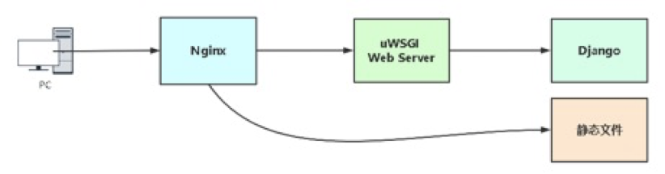
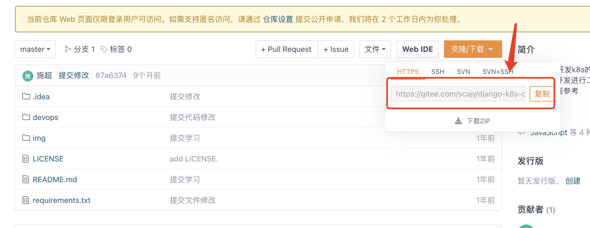
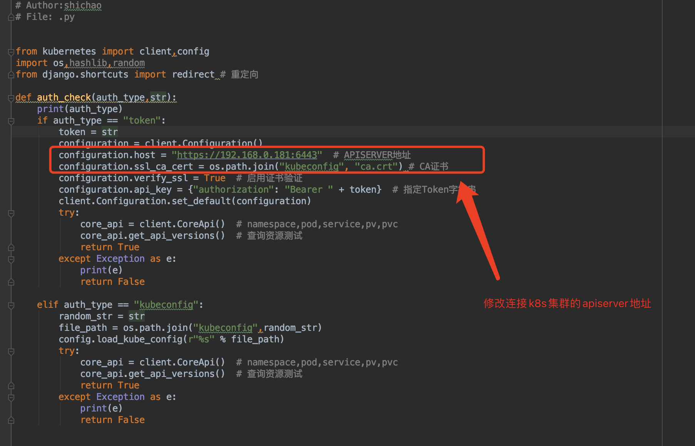
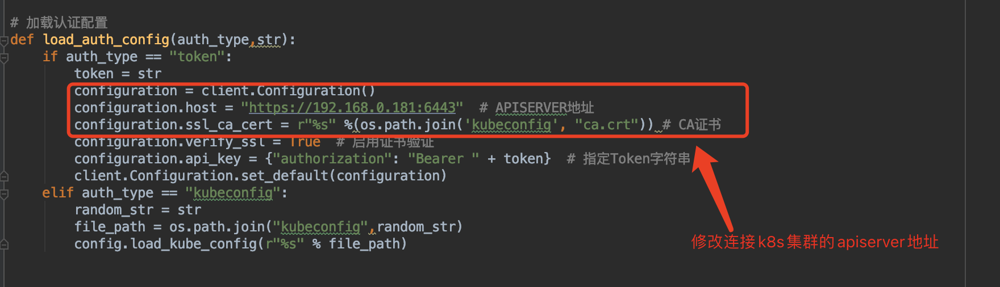
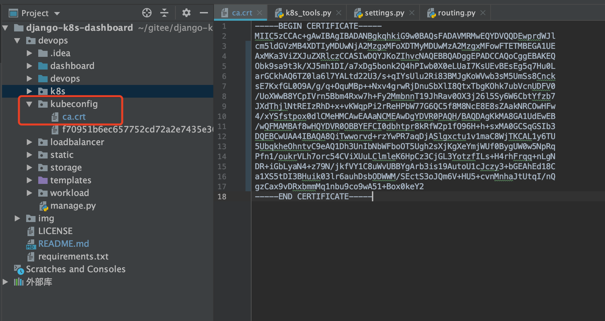
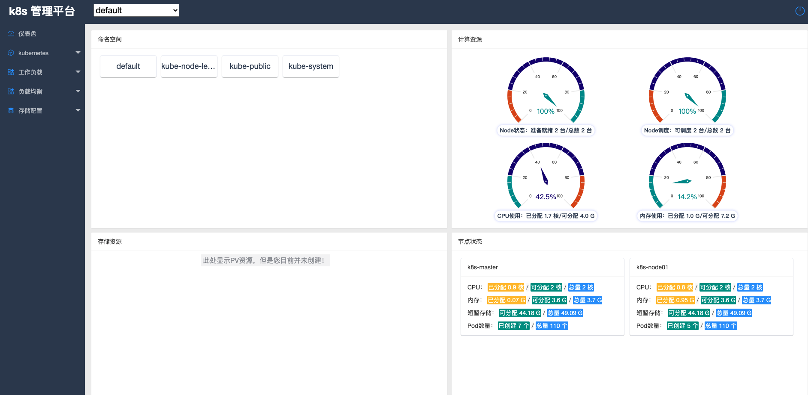
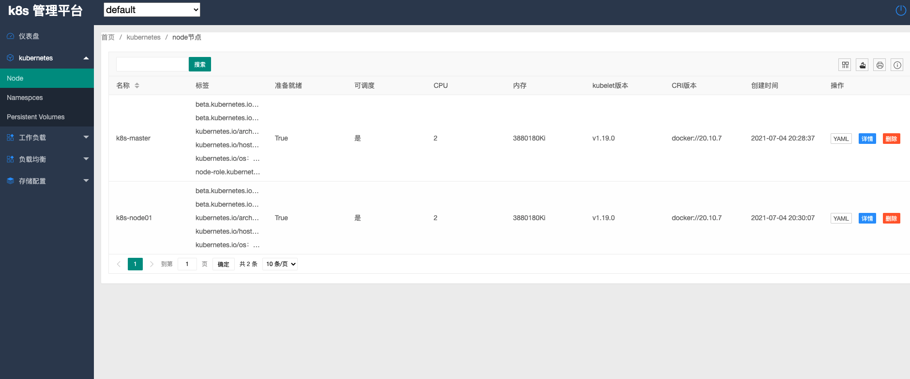
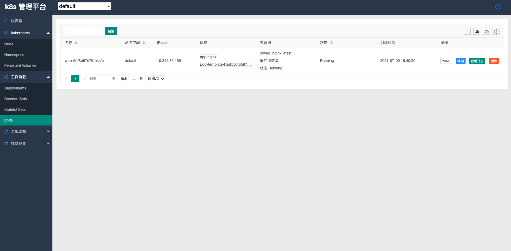

# >k8s-生产环境部署django项目


### 1. k8s-生产环境部署django项目

- 部署架构

  

  nginx 前端web服务，接收到动态请求通过uwsgi模块将请求转发给uwsgi服务器，uwsgi服务器通过django处理完后返回给Nginx，Nginx返回用户浏览器展示。

- **既然uwsgi是一个可以独立部署的服务器，为什么还用Nginx代理？**

  - Nginx作为入口可配置安全策略，并且可以为uwsgi提供负载均衡。
  - Nginx处理静态资源能力强
  
- 本次使用的python版本为：Python 3.8.4

### 2. 克隆源代码

- 使用git工具克隆源代码

  

  ```shell
  cd /root/
  git clone https://gitee.com/scajy/django-k8s-dashboard.git
  cd django-k8s-dashboard/devops
  ```

#### 2.1 修改数据库配置

```python
# vim devops/settings.py

# 找到下面配置，修改为自己的
DATABASES = {
	'default': {
        'ENGINE': 'django.db.backends.mysql',
        'NAME': 'k8s',
        'USER': 'root',
        'PASSWORD': '123456',
        'HOST': '127.0.0.1',     # 这里IP根据自己mysql运行位置部署地址修改
        'PORT': '3306',
	}
}
```

#### 2. 2 关闭debug模式和白名单

```python
# SECURITY WARNING: don't run with debug turned on in production!
DEBUG = False     # 关闭调试模式

# 开启用户访问IP
ALLOWED_HOSTS = ['*']     # 白名单，只允许列表中的ip访问，*代表所有
```

#### 2.3   修改k8s认证token配置

```
vim devops/k8s_tools.py
```





#### 2.4 修改k8s的ca证书

我这里是kubeadm安装的k8s，默认ca证书路径在

```shell
[root@k8s-master pki]# cd /etc/kubernetes/pki/
[root@k8s-master pki]# cat ca.crt 
-----BEGIN CERTIFICATE-----
MIIC5zCCAc+gAwIBAgIBADANBgkqhkiG9w0BAQsFADAVMRMwEQYDVQQDEwprdWJl
cm5ldGVzMB4XDTIyMDUwNjA2MzgxMFoXDTMyMDUwMzA2MzgxMFowFTETMBEGA1UE
AxMKa3ViZXJuZXRlczCCASIwDQYJKoZIhvcNAQEBBQADggEPADCCAQoCggEBAKEQ
Obk9sa9t3k/XJ5mh1DI/a7xDg5bonk2Q4hPIwb0X0eLUaI7KsUEvBEsEg5q7Hu0L
arGCkhAQ6TZ0la6l7YALtd22U3/s+qIYsUlu2Ri83BMJgKoWVwb3sM5UmSs8Cnck
sE7KxfGL0O9A/g/q+OquMBp++Nxv4grwRjDnuSbXlI8QtxTbgKOhk7ubVcnUDFV0
/UoXWwB8YCpIVrn5Bbm4Rxw7h+Fy2MmbnnT19JhRav0OX3j26l5Sy6W6CbtYfzb7
JXdThjlNtREIzRhD+x+vKWqpPi2rReHPbW77G6QC5f8M8NcE8E8sZAakNRCOwHFw
4/xYSfstpox0dlCMeHMCAwEAAaNCMEAwDgYDVR0PAQH/BAQDAgKkMA8GA1UdEwEB
/wQFMAMBAf8wHQYDVR0OBBYEFCI0dbhtpr8kRfW2p1fO96H+h+sxMA0GCSqGSIb3
DQEBCwUAA4IBAQA8QiTwworvd+rzYwPR7aqDjASlgxctu1v1maC8WjTKCAL1y6TU
5UbqkheOhntvC9eAQ1Dh3UnIbNbWFboOT5Ugh2sXjKgXeYmjWUf0BygUW0w5NpRq
Pfn1/oukrVLh7orc54CViXUuLClmleK6HpCz3CjGL3YotzfILs+H4rhFrqq+nLgN
DR+iGbLyaN4+z79N/jkfVY1C8uWvUBBYgArb3is19AutoU1cJczy3+bGEAhEd18C
a1XS5tDI3BHuik03lr6auhDsbODWWM/SEctS3oJQm6V+HU5+cvnMnhaJtUtqI/nQ
gzCax9vDRxbmmMq1nbu9co9wA51+Box0keY2
-----END CERTIFICATE-----
```

修改kubeconfig里存放的ca.crt认证证书



> 把拿到k8s集群里的ca.crt密钥，存放到kubeconfig的ca.crt里

#### 2.5 在k8s集群里面创建认证账号

- 创建service account并绑定默认cluster-admin管理员集群角色：

  ```shell
  # 创建用户
  kubectl create serviceaccount dashboard-admin -n kube-system
  
  
  # 用户授权
  kubectl create clusterrolebinding dashboard-admin --clusterrole=cluster-admin --serviceaccount=kube-system:dashboard-admin
  
  
  # 获取用户Token
  kubectl describe secrets -n kube-system $(kubectl -n kube-system get secret | awk '/dashboard-admin/{print $1}')
  ```

- 执行角色权限

  ```shell
  [root@k8s-master ~]# kubectl create serviceaccount dashboard-admin -n kube-system
  serviceaccount/dashboard-admin created
  
  [root@k8s-master ~]# kubectl create clusterrolebinding dashboard-admin --clusterrole=cluster-admin --serviceaccount=kube-system:dashboard-admin
  clusterrolebinding.rbac.authorization.k8s.io/dashboard-admin created
  
  
  [root@k8s-master ~]# kubectl describe secrets -n kube-system $(kubectl -n kube-system get secret | awk '/dashboard-admin/{print $1}')
  Name:         dashboard-admin-token-jn99l
  Namespace:    kube-system
  Labels:       <none>
  Annotations:  kubernetes.io/service-account.name: dashboard-admin
                kubernetes.io/service-account.uid: 49ecbae8-aa19-4315-b8d0-2001a1caaaa9
  
  Type:  kubernetes.io/service-account-token
  
  Data
  ====
  ca.crt:     1066 bytes
  namespace:  11 bytes
  token:      eyJhbGciOiJSUzI1NiIsImtpZCI6Ik1sT2NmYnVraGIzM3lyalU1WDZPcmtuOFlqSEZVSERnN1VEeU5jODVxMHMifQ.eyJpc3MiOiJrdWJlcm5ldGVzL3NlcnZpY2VhY2NvdW50Iiwia3ViZXJuZXRlcy5pby9zZXJ2aWNlYWNjb3VudC9uYW1lc3BhY2UiOiJrdWJlLXN5c3RlbSIsImt1YmVybmV0ZXMuaW8vc2VydmljZWFjY291bnQvc2VjcmV0Lm5hbWUiOiJkYXNoYm9hcmQtYWRtaW4tdG9rZW4tam45OWwiLCJrdWJlcm5ldGVzLmlvL3NlcnZpY2VhY2NvdW50L3NlcnZpY2UtYWNjb3VudC5uYW1lIjoiZGFzaGJvYXJkLWFkbWluIiwia3ViZXJuZXRlcy5pby9zZXJ2aWNlYWNjb3VudC9zZXJ2aWNlLWFjY291bnQudWlkIjoiNDllY2JhZTgtYWExOS00MzE1LWI4ZDAtMjAwMWExY2FhYWE5Iiwic3ViIjoic3lzdGVtOnNlcnZpY2VhY2NvdW50Omt1YmUtc3lzdGVtOmRhc2hib2FyZC1hZG1pbiJ9.NsW4-Ib6qrt_GBx0E0CK3GLkggENUVnHDFc62tkUhnE-F95r2UESipaqh25nFRPvhirYegr-U7rRHC1V_N1TT505LE7h6P5Tp_-tPXbW25PYGABHAY_-kd_RvEicSt2R8m2Oclfm3XpEjCq36S3WTx2I2TwbgI1V3x-SVICI2C6KbJPv2p9HzRF-Pa4f4kwlCs7Ubk7cEe_dvbu_GI3grBQWXmndXyDZtOZaPHlFAs-1bBpTgp2h96wpCZ038z_LAURn7jaQ4RM0ofjzhbNitqYabx2d6GmeaZWXyuPmA07A9oD8FMs4BeSNwsRps2pziuYZf-mmgu8KsWYdlh_WQA
  ```

- 提取到的token

  ```
  eyJhbGciOiJSUzI1NiIsImtpZCI6Ik1sT2NmYnVraGIzM3lyalU1WDZPcmtuOFlqSEZVSERnN1VEeU5jODVxMHMifQ.eyJpc3MiOiJrdWJlcm5ldGVzL3NlcnZpY2VhY2NvdW50Iiwia3ViZXJuZXRlcy5pby9zZXJ2aWNlYWNjb3VudC9uYW1lc3BhY2UiOiJrdWJlLXN5c3RlbSIsImt1YmVybmV0ZXMuaW8vc2VydmljZWFjY291bnQvc2VjcmV0Lm5hbWUiOiJkYXNoYm9hcmQtYWRtaW4tdG9rZW4tam45OWwiLCJrdWJlcm5ldGVzLmlvL3NlcnZpY2VhY2NvdW50L3NlcnZpY2UtYWNjb3VudC5uYW1lIjoiZGFzaGJvYXJkLWFkbWluIiwia3ViZXJuZXRlcy5pby9zZXJ2aWNlYWNjb3VudC9zZXJ2aWNlLWFjY291bnQudWlkIjoiNDllY2JhZTgtYWExOS00MzE1LWI4ZDAtMjAwMWExY2FhYWE5Iiwic3ViIjoic3lzdGVtOnNlcnZpY2VhY2NvdW50Omt1YmUtc3lzdGVtOmRhc2hib2FyZC1hZG1pbiJ9.NsW4-Ib6qrt_GBx0E0CK3GLkggENUVnHDFc62tkUhnE-F95r2UESipaqh25nFRPvhirYegr-U7rRHC1V_N1TT505LE7h6P5Tp_-tPXbW25PYGABHAY_-kd_RvEicSt2R8m2Oclfm3XpEjCq36S3WTx2I2TwbgI1V3x-SVICI2C6KbJPv2p9HzRF-Pa4f4kwlCs7Ubk7cEe_dvbu_GI3grBQWXmndXyDZtOZaPHlFAs-1bBpTgp2h96wpCZ038z_LAURn7jaQ4RM0ofjzhbNitqYabx2d6GmeaZWXyuPmA07A9oD8FMs4BeSNwsRps2pziuYZf-mmgu8KsWYdlh_WQA
  ```

### 3. 服务器环境准备

#### 3.1 安装python3

- 安装依赖包

  ```
  yum -y install zlib-devel bzip2-devel openssl-devel ncurses-devel sqlite-devel readline-devel tk-devel gdbm-devel db4-devel libpcap-devel xz-devel libffi-devel
  ```

- 第一种方式用yum安装

  - Linux安装：

    ```shell
    wget https://www.python.org/ftp/python/3.8.6/Python-3.8.6.tgz
    tar zxvf Python-3.8.6.tgz
    cd Python-3.8.6
    ./configure
    make && make install
    ```
    
    >  运行上面命令完成安装。


#### 3.2 安装k8s依赖模块列表

- 安装依赖包

  ```
  [root@k8s-master ~]# pip3 install -r /root/django-k8s-dashboard/requirements.txt -i  http://mirrors.aliyun.com/pypi/simple --trusted-host mirrors.aliyun.com
  ```

  ```
  [root@ansible devops]# cat /root/django-k8s-dashboard/requirements.txt
  aioredis==1.3.1
  asgiref==3.5.2
  async-timeout==4.0.2
  attrs==21.4.0
  autobahn==22.6.1
  Automat==20.2.0
  backports.zoneinfo==0.2.1
  cachetools==5.2.0
  certifi==2022.6.15
  cffi==1.15.1
  channels==3.0.5
  channels-redis==3.4.1
  charset-normalizer==2.1.0
  constantly==15.1.0
  cryptography==37.0.4
  daphne==3.0.2
  Django==4.0.6
  google-auth==2.9.1
  hiredis==2.0.0
  hyperlink==21.0.0
  idna==3.3
  incremental==21.3.0
  kubernetes==24.2.0
  msgpack==1.0.4
  oauthlib==3.2.0
  pyasn1==0.4.8
  pyasn1-modules==0.2.8
  pycparser==2.21
  PyMySQL==1.0.2
  pyOpenSSL==22.0.0
  python-dateutil==2.8.2
  PyYAML==6.0
  requests==2.28.1
  requests-oauthlib==1.3.1
  rsa==4.8
  service-identity==21.1.0
  six==1.16.0
  sqlparse==0.4.2
  Twisted==22.4.0
  txaio==22.2.1
  typing_extensions==4.3.0
  urllib3==1.26.10
  websocket-client==1.3.3
  ```

#### 3.3 安装数据库

- mysql安装

  ```shell
  [root@k8s-master ~]# docker run -d --name db -p 3306:3306 -v mysqldata:/var/lib/mysql -e MYSQL_ROOT_PASSWORD=123456 mysql:5.7 --character-set-server=utf8
  [root@k8s-master ~]# docker exec  -it db bash
  root@f992b2375c5d:/# mysql -uroot -p$MYSQL_ROOT_PASSWORD 
  mysql: [Warning] Using a password on the command line interface can be insecure.
  Welcome to the MySQL monitor.  Commands end with ; or \g.
  Your MySQL connection id is 2
  Server version: 5.7.34 MySQL Community Server (GPL)
  
  Copyright (c) 2000, 2021, Oracle and/or its affiliates.
  
  Oracle is a registered trademark of Oracle Corporation and/or its
  affiliates. Other names may be trademarks of their respective
  owners.
  
  Type 'help;' or '\h' for help. Type '\c' to clear the current input statement.
  
  mysql> create database k8s;
  Query OK, 1 row affected (0.00 sec)
  
  mysql> flush privileges;
  Query OK, 0 rows affected (0.00 sec)
  ```

- 安装redis：

  ```shell
  [root@k8s-master ~]# docker run --name redis -d -p 6379:6379 redis:3
  ```

#### 3.4 启动开发环境

- 启动程序，验证依赖模块

  ```shell
  [root@k8s-master devops]# cd /root/django-k8s-dashboard/devops
  [root@k8s-master devops]# python3 manage.py runserver 0.0.0.0:8000
  Watching for file changes with StatReloader
  Performing system checks...
  
  System check identified no issues (0 silenced).
  
  You have 18 unapplied migration(s). Your project may not work properly until you apply the migrations for app(s): admin, auth, contenttypes, sessions.
  Run 'python manage.py migrate' to apply them.
  July 05, 2021 - 11:36:44
  Django version 3.2.5, using settings 'devops.settings'
  Starting ASGI/Channels version 3.0.3 development server at http://0.0.0.0:8000/
  ```

- 测试没有问题，同步数据库

  ```shell
  [root@k8s-master devops]# python3 manage.py migrate
  Operations to perform:
    Apply all migrations: admin, auth, contenttypes, sessions
  Running migrations:
    Applying contenttypes.0001_initial... OK
    Applying auth.0001_initial... OK
    Applying admin.0001_initial... OK
    Applying admin.0002_logentry_remove_auto_add... OK
    Applying admin.0003_logentry_add_action_flag_choices... OK
    Applying contenttypes.0002_remove_content_type_name... OK
    Applying auth.0002_alter_permission_name_max_length... OK
    Applying auth.0003_alter_user_email_max_length... OK
    Applying auth.0004_alter_user_username_opts... OK
    Applying auth.0005_alter_user_last_login_null... OK
    Applying auth.0006_require_contenttypes_0002... OK
    Applying auth.0007_alter_validators_add_error_messages... OK
    Applying auth.0008_alter_user_username_max_length... OK
    Applying auth.0009_alter_user_last_name_max_length... OK
    Applying auth.0010_alter_group_name_max_length... OK
    Applying auth.0011_update_proxy_permissions... OK
    Applying auth.0012_alter_user_first_name_max_length... OK
    Applying sessions.0001_initial... OK
  ```

#### 3.4  安装与配置uwsgi

- Centos7 服务器安装依赖包

  ```shell
  [root@k8s-master devops]# yum -y install gcc gcc-c++ gd cmake patch  automakemake autoconf libjpeg libjpeg-devel libpng libpng-devel freetype freetype-devellibxml2 libxml2-devel zlib zlib-devel glibc glibc-devel glib2 glib2-devel bzip2bzip2-devel ncurses ncurses-devel curl curl-devel e2fsprogs e2fsprogs-develkrb5 krb5-devel libidn libtools-libs libidn-devel openssl openssl-developenldap openldap-devel nss_ldap openldap-clients openldap-servers pcre-devel libmcrypt-devel readline-devellibcap-devel ntpdate vim tree wget python3-devel.x86_64
  ```

- uWSGI是一个[Web服务器](https://baike.baidu.com/item/Web服务器/8390210)，也是Python的一个模块，直接pip安装即可：

  ```shell
  [root@k8s-master devops]# pip3 install uwsgi -i http://mirrors.aliyun.com/pypi/simple --trusted-host mirrors.aliyun.com
  ```

- 拷贝克隆下来的内容，移动到运行k8s目录

  ```shell
  [root@k8s-master ~]#  mkdir -p /opt/k8s
  [root@k8s-master ~]#  cp -a /root/django-k8s-dashboard/devops/* /opt/k8s/
  ```
  
- 创建uwsgi配置文件，路径任意，

  ```shell
  [root@k8s-master ~]# mkdir -p /opt/uwsgi
  [root@k8s-master ~]# cd /opt/uwsgi
  [root@k8s-master uwsgi]# vim uwsgi.ini 
  [root@k8s-master uwsgi]# cat uwsgi.ini 
  [uwsgi]
  # 项目目录
  chdir = /opt/k8s
  
  # 指定sock的文件路径
  socket = /opt/k8s/uwsgi.sock
  # 指定监听端口
  http = 0.0.0.0:8080
  
  # 静态资源
  static-map = /static=/opt/k8s/static
  
  # wsgi文件（django入口）
  wsgi-file=devops/wsgi.py
  
  # 进程个数
  processes = 1
  
  # 指定项目的应用
  # module = devops.wsgi
  
  # 进程pid
  pidfile = /opt/k8s/uwsgi.pid
  
  # 日志路径
  daemonize = /opt/k8s/uwsgi.log
  ```

- 启动

  ```shell
  [root@k8s-master uwsgi]# uwsgi --ini uwsgi.ini 
  [uWSGI] getting INI configuration from uwsgi.ini
  [uwsgi-static] added mapping for /static => /opt/k8s/static
  ```

- 验证服务启动

  ```shell
  [root@k8s-master uwsgi]# ss -antp |grep 8080
  LISTEN     0      100          *:8080                     *:*                   users:(("uwsgi",pid=4871,fd=3),("uwsgi",pid=4870,fd=3))
  ```

#### 3.5 安装nginx

- 安装nginx

  ```shell
  [root@k8s-master uwsgi]# yum localinstall http://nginx.org/packages/centos/7/noarch/RPMS/nginx-release-centos-7-0.el7.ngx.noarch.rpm
  [root@k8s-master uwsgi]# yum -y install nginx
  [root@k8s-master uwsgi]# service nginx start
  Redirecting to /bin/systemctl start nginx.service
  [root@k8s-master uwsgi]# systemctl enable nginx.service
  Created symlink from /etc/systemd/system/multi-user.target.wants/nginx.service to /usr/lib/systemd/system/nginx.service.
  ```

- 配置nginx

  ```shell
  [root@k8s-master uwsgi]# cd /etc/nginx/
  [root@k8s-master nginx]# ll
  total 76
  drwxr-xr-x 2 root root 4096 Jun  2 08:24 conf.d
  drwxr-xr-x 2 root root 4096 Jun  2 08:24 default.d
  -rw-r--r-- 1 root root 1077 Jun  2 08:24 fastcgi.conf
  -rw-r--r-- 1 root root 1077 Jun  2 08:24 fastcgi.conf.default
  -rw-r--r-- 1 root root 1007 Jun  2 08:24 fastcgi_params
  -rw-r--r-- 1 root root 1007 Jun  2 08:24 fastcgi_params.default
  -rw-r--r-- 1 root root 2837 Jun  2 08:24 koi-utf
  -rw-r--r-- 1 root root 2223 Jun  2 08:24 koi-win
  -rw-r--r-- 1 root root 5231 Jun  2 08:24 mime.types
  -rw-r--r-- 1 root root 5231 Jun  2 08:24 mime.types.default
  -rw-r--r-- 1 root root 2336 Jun  2 08:23 nginx.conf
  -rw-r--r-- 1 root root 2656 Jun  2 08:24 nginx.conf.default
  -rw-r--r-- 1 root root  636 Jun  2 08:24 scgi_params
  -rw-r--r-- 1 root root  636 Jun  2 08:24 scgi_params.default
  -rw-r--r-- 1 root root  664 Jun  2 08:24 uwsgi_params
  -rw-r--r-- 1 root root  664 Jun  2 08:24 uwsgi_params.default
  -rw-r--r-- 1 root root 3610 Jun  2 08:24 win-utf
  [root@k8s-master nginx]# cd conf.d/
  [root@k8s-master conf.d]# vim k8s-dashboard.conf 
  [root@k8s-master conf.d]# cat k8s-dashboard.conf 
  server {
          listen       80;
          server_name  k8s-dashboard.scajy.cn;
  
          location / {
             include     uwsgi_params;  # 导入模块用于与uwsgi通信
             uwsgi_pass unix:/opt/k8s/uwsgi.sock; 
          }
          # 静态文件目录
          location /static {
             alias /opt/k8s/static;
          }
  }
  ```

- 重启nginx

  ```shell
  [root@k8s-master conf.d]# nginx -t
  nginx: the configuration file /etc/nginx/nginx.conf syntax is ok
  nginx: configuration file /etc/nginx/nginx.conf test is successful
  [root@k8s-master conf.d]# nginx -s reload
  ```

- 域名解析

  这个根据自己域名进行配置域名解析


### 4. 浏览器访问






